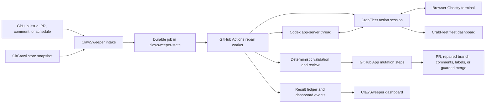

# Steerable Repair Automation

Read this guide to understand how ClawSweeper turns GitHub work into bounded,
observable, steerable Codex sessions. It covers issue-to-PR work, PR repair,
GitCrawl cluster intake, GitHub App authentication, durable session resumption,
CrabFleet terminal steering, worker capacity, completion gates, dashboards,
opt-out controls, and failure recovery.

This is the system-level guide. Detailed repair policy remains in
[`repair/README.md`](repair/README.md), worker limits in
[`limits.md`](limits.md), dashboard implementation in
[`live-dashboard.md`](live-dashboard.md), and the CrabFleet transport contract
in
[`openclaw/crabfleet/docs/github-actions-sessions.md`](https://github.com/openclaw/crabfleet/blob/main/docs/github-actions-sessions.md).

## Goals

The automation is designed around five goals:

1. Useful pull requests should become correct and mergeable faster.
2. Useful issues without an existing implementation path should be convertible
   into one focused pull request.
3. Related or duplicate reports should be handled as one work unit instead of
   producing competing pull requests.
4. Long-running Codex work should be observable and steerable without making a
   browser or laptop the execution host.
5. GitHub mutations should remain deterministic, authenticated, bounded, and
   reversible when the model, runner, network, or operator disappears.

The system separates model judgment from mutation authority. Codex reviews and
edits code. TypeScript and GitHub Actions decide whether work is allowed,
validate the result, and perform GitHub writes with short-lived GitHub App
credentials.

## System Map



Ownership boundaries:

- **ClawSweeper** owns intake, deduplication, policy, job files, Codex prompts,
  validation, repair execution, GitHub mutations, ledgers, and completion
  criteria.
- **GitHub Actions** is the execution environment. A browser connection is not
  required for work to continue.
- **CrabFleet** owns the durable action-session registry, browser terminal
  relay, work-state timeline, terminal archives, and operator steering
  transport.
- **`openclaw/clawsweeper-state`** owns generated operational state: jobs,
  reports, results, intake ledgers, notifications, and dashboard source data.
- **GitCrawl** groups related GitHub items. ClawSweeper consumes a published
  SQLite snapshot; it does not crawl GitHub during cluster intake.

## Work Types

Every steerable repair job is presented in the dashboards as one of three work
types.

| Work kind        | Durable job intent                        | Purpose                                                                   |
| ---------------- | ----------------------------------------- | ------------------------------------------------------------------------- |
| `issue_to_pr`    | `implement_issue`                         | Verify one issue and open or update one focused implementation PR.        |
| `pr_repair`      | `automerge_pr`                            | Repair, rebase, validate, re-review, and optionally merge an opted-in PR. |
| `repair_cluster` | `repair_cluster` or another repair intent | Review and repair related issues and PRs, including GitCrawl imports.     |

The work kind affects dashboard grouping and operator context. It does not
bypass repair policy or mutation gates.

## Intake Paths

### Maintainer and Organization-Member Commands

An eligible OpenClaw organization member can comment on an open issue:

```text
@clawsweeper implement issue
@clawsweeper implement
@clawsweeper fix
@clawsweeper build
@clawsweeper create pr
```

The comment router:

1. Verifies that the target is an open issue.
2. Verifies the command author. Repository maintainers are accepted through
   collaborator permission; OpenClaw organization owners and members may
   explicitly request issue implementation.
3. Checks pause labels and existing PR signals.
4. Creates or reuses one durable issue implementation job.
5. Dispatches the normal repair worker in autonomous mode.
6. Edits the marker-backed command status comment with progress and outcome.

PR commands use the same repair worker:

```text
@clawsweeper autofix
@clawsweeper automerge
@clawsweeper fix ci
@clawsweeper address review
@clawsweeper rebase
```

`autofix` permits bounded repair but never merge. `automerge` adds per-PR merge
authorization, but merge still requires the global merge gate, a clean
exact-head review, green checks, clean mergeability, and no unresolved safety
blocker.

### Automatic Issue Intake

Automatic issue-to-PR pickup is disabled unless repository variables explicitly
enable it. The master gate is:

```text
CLAWSWEEPER_AUTO_IMPLEMENT_ISSUES=1
```

Additional candidate gates select the permitted automatic lane:

- `CLAWSWEEPER_AUTO_IMPLEMENT_REPRO_BUGS=1` for strict, high-confidence
  reproduced bugs.
- `CLAWSWEEPER_AUTO_IMPLEMENT_VISION_FIT=1` for small, clearly aligned work
  backed by `VISION.md` evidence.
- Eligible configured repositories outside the stricter core profiles may use
  the reviewed `viable` candidate path.

The viable path applies to newly reviewed issues and bounded backfill from
existing open issue reports in eligible public `openclaw/*` and `steipete/*`
repositories, excluding `openclaw/openclaw` and `openclaw/clawhub`. It requires
a complete current kept-open review, but does not require that review to
prescribe likely files, validation commands, a repair prompt, or high-confidence
implementation metadata. Codex inspects the repository and owns that discovery.
Deterministic intake still enforces live issue state, protected/security
labels, opt-out labels, source identity, queued-job and PR deduplication.
Durable intake receipts also suppress repeat dispatch of the same report
revision; a later review revision can retry the issue.

With the master gate absent or disabled, reviewed issues are not automatically
converted. A member may still explicitly ask ClawSweeper to implement an issue.

Automatic intake remains PR-only. It does not close the source issue and does
not merge the generated PR as part of issue implementation.

### GitCrawl Cluster Intake

GitCrawl data is consumed in GitHub Actions, not from a maintainer laptop.

The `repair-cluster-intake.yml` workflow:

1. Mints a read-only GitHub App token for `openclaw/gitcrawl-store`.
2. Checks out the current portable store snapshot.
3. Reads `data/<owner>__<repo>.sync.db` and its adjacent manifest.
4. Compares the manifest SHA-256 with
   `results/cluster-repair-intake/<repo-slug>.json`.
5. Skips a store snapshot that was already processed unless a maintainer uses
   the force input.
6. Imports a bounded number of eligible clusters into durable job markdown.
7. Publishes the jobs and updated intake ledger.
8. Dispatches them through the `repair_cluster` lane with capacity waiting.

Scheduled cluster intake is independently gated:

```text
CLAWSWEEPER_FEATURE_CLUSTER_REPAIR_ENABLED=1
```

The default scheduled import is one cluster per run. Imported cluster repair is
also separately capped at two live workers by
`lanes.repair.cluster_max_live_runs`. This prevents a large fresh GitCrawl
snapshot from consuming the full Codex fleet.

The importer excludes or escalates unsuitable work, including mostly closed
clusters, protected or security-sensitive reports, feature-only clusters when
the selected policy requires bugs, and clusters without a safe canonical repair
shape.

## Deduplication

Deduplication happens at several layers because no single signal is sufficient.

### Issue-Level PR Detection

Before issue implementation begins, ClawSweeper checks live GitHub state for:

- open PRs that mention or link the issue;
- existing ClawSweeper issue implementation branches and PRs;
- open PRs covering another issue in the same work cluster;
- PRs referenced by the durable review report when their state is open or
  cannot be safely verified;
- linked, open, and existing PR arrays discovered by the comment router.

An existing linked PR is a hard blocker for normal issue-to-PR creation. The
status comment explains the blocker instead of silently opening a second PR.

### Stable Job Identity

Issue implementation uses one deterministic job and branch identity for the
issue. Reruns update or resume that path rather than creating a new independent
attempt.

Repair clusters carry a stable `cluster_id`. The CrabFleet work key is:

```text
<target-repo>:<cluster-id>
```

That key maps repeated GitHub Actions attempts to one logical CrabFleet session
and one durable Codex thread state.

### GitCrawl Store Ledger

Cluster intake records the processed store content hash. A delayed schedule or
duplicate workflow tick against the same exported database does not enqueue the
same snapshot again.

### GitHub Actions Concurrency

`repair-cluster-worker.yml` serializes identical job path and mode pairs:

```text
clawsweeper-repair-<job-path>-<mode>
```

Different jobs may run concurrently. The same logical job is queued instead of
executed twice at the same time.

### Mutation Idempotency

Comments use hidden markers and are edited in place. Repair and result ledgers
use stable keys. PR creation reuses deterministic branches. Applicators re-fetch
live state before writing and skip already-applied comments, closures, or
equivalent outcomes.

## Opt-Out and Pause Controls

The normal opt-out labels are:

- `clawsweeper:manual-only`
- `clawsweeper:human-review`

Both labels stop automatic PR repair and issue-to-PR mutation. They are checked
during intake and rechecked in live execution before branch mutation, so adding
a pause label after a worker started still wins over stale queued work.

For command-driven work:

```text
@clawsweeper stop
```

`stop` removes active repair-loop labels, adds the human-review pause, and makes
older trusted automerge or autofix markers ineligible to continue.

Additional protected labels, including repository-specific release, security,
or maintainer labels, can block issue implementation and repair according to
the repository profile.

## Durable Work Identity

Three identities are related but intentionally distinct:

1. **Job identity**: durable markdown path and `cluster_id` in
   `clawsweeper-state`.
2. **GitHub Actions attempt**: one plan or execute runner attempt with a run URL.
3. **CrabFleet action session**: one logical interactive session keyed by
   `<repo>:<cluster-id>`.

A new Action attempt registers the same work key with CrabFleet. CrabFleet:

- returns the existing logical session when one exists;
- rotates the session-scoped agent token;
- clears stale terminal and finalization state;
- records `registered / waiting_for_runner`;
- disconnects any previous runner socket;
- updates the current GitHub Actions run URL.

This lets the logical work survive runner replacement, retries, planning to
execution transitions, and requeues. The Action runner is disposable; the work
identity is not.

## Persistent Codex Threads

Steerable mode is enabled with:

```text
CLAWSWEEPER_STEERABLE_CODEX=1
```

For each job path, the workflow derives a stable work hash and uses a dedicated
`CODEX_HOME`. It restores and saves only:

- the Codex app-server `sessions/` directory;
- `clawsweeper-thread-state.json`, containing the thread ID and optional session
  ID.

The planning and execution jobs use restore prefixes for the same work hash.
The app-server wrapper first attempts `thread/resume`; if that stored thread is
unavailable, it reports the fallback and starts a new non-ephemeral thread.

The persistent thread provides conversational continuity. It does not make one
GitHub Actions process run for days. Individual runner jobs remain bounded by
workflow timeouts, while later attempts can resume the same logical work.

## GitHub Actions Lifecycle

### Planning Job

The planning job performs:

1. Source checkout.
2. Short-lived read-only GitHub App token creation.
3. Durable state checkout.
4. Execution-gate capture.
5. Stable Codex session path resolution and cache restore.
6. Local repair lifecycle registration, with CrabFleet session registration
   only when steerable mode is enabled.
7. Job validation and stale-head verification.
8. Codex planning or autonomous artifact generation.
9. Deterministic result review.
10. Exact current-attempt action-ledger finalization and artifact upload.
11. Debug and transfer artifact upload.
12. Codex session cache save.

Plan-only work ends with:

```text
state: completed
phase: done
completion_reason: plan_complete
```

Execute or autonomous work instead records `running / planned` and starts the
execution job.

### Execution Job

The execution job:

1. Mints a separate write-capable GitHub App token.
2. Restores durable state and the same Codex thread.
3. Re-registers the same CrabFleet work key, rotating credentials.
4. Downloads the planning artifact.
5. Revalidates the job and source head.
6. Runs the bounded Codex edit, validation, and review loop when execution gates
   are open.
7. Applies allowed close or merge actions deterministically.
8. Runs post-flight checks against the pushed head and live GitHub state.
9. Finalizes and uploads the exact current-attempt execution action ledger.
10. Publishes final result artifacts and saves the Codex session.

The trusted `repair-publish-results` workflow then checks which receipt
capabilities existed at the exact worker SHA. For the current topology it
requires one authenticated ledger from every started cluster or execute job,
rejects missing or cross-attempt producers, imports both worker lanes with its
own publication lane, and only then mutates durable result state. Older
in-flight worker SHAs that did not advertise this topology remain compatible;
the publisher does not manufacture receipts for them.

Successful execution ends with:

```text
state: completed
phase: done
completion_reason: gates_passed
```

If the source head changes during work, the executor records a requeue request
and the workflow dispatches the same job against the new head. CrabFleet reports
`running / requeued` rather than incorrectly marking the logical work complete.

### Failure States

Planning or execution failure reports:

```text
state: blocked
phase: planning_failed | action_failed | codex_failed
completion_reason: action_failed
```

An operator cancellation reports `canceled`. A blocked state means the work
reached a terminal condition without satisfying all required gates; it is not
equivalent to success.

## Steering

ClawSweeper launches `codex app-server` over stdio when steerable mode is
enabled. The wrapper:

1. Initializes the app-server.
2. Starts or resumes the durable thread.
3. Starts a turn with the normal prompt, sandbox policy, output schema, and
   configured model alias.
4. Connects outbound to CrabFleet through the session-scoped runner WebSocket.
5. Streams agent-message deltas and lifecycle notices into the browser
   terminal.
6. Buffers operator terminal input until Enter.
7. Sends the entered instruction through Codex `turn/steer` for the active
   thread and expected turn.

Example steering instruction:

```text
Report the current phase and continue without changing scope.
```

The terminal echoes accepted input with a `[steer]` prefix. `Ctrl-C` requests
`turn/interrupt` for the current turn.

Steering is available only while a Codex turn is active. After the turn
completes, deterministic GitHub Actions steps continue, and the terminal reports
that there is no active steerable turn.

Steering changes the active model turn; it does not bypass:

- the job's allowed target repository;
- sandbox and network policy;
- execution, fix-PR, or merge gates;
- deterministic validation;
- exact-head checks;
- label and protected-item checks;
- GitHub App permission boundaries.

## Heartbeats and Status Reporting

While a Codex turn is active, the app-server wrapper posts a work-state heartbeat
every 60 seconds and writes a matching terminal notice. Each update includes:

- work state;
- phase;
- human-readable summary;
- Codex thread ID;
- Codex turn ID;
- heartbeat timestamp.

The main phases currently include:

- `waiting_for_runner`
- `codex`
- `validating`
- `planned`
- `post_flight`
- `requeued`
- `done`
- failure-specific phases such as `planning_failed` and `action_failed`

Because heartbeats occur every minute while Codex is active, the system exceeds
the minimum requirement of an hourly status report. GitHub Actions step state,
CrabFleet events, and ClawSweeper dashboard refreshes provide additional
independent signals.

## Knowing When Work Is Done

The Codex turn ending is not the completion signal.

Work is complete only when the workflow emits a terminal work state with an
explicit completion reason:

| State       | Completion reason        | Meaning                                                                     |
| ----------- | ------------------------ | --------------------------------------------------------------------------- |
| `completed` | `plan_complete`          | Planning and deterministic result review passed; no mutation was requested. |
| `completed` | `gates_passed`           | Repair, validation, review, push, and post-flight gates passed.             |
| `blocked`   | `action_failed`          | The Action ended before all required gates passed.                          |
| `canceled`  | `stopped from Crabfleet` | An authorized operator canceled the action session.                         |

For execute or autonomous work, `gates_passed` means the relevant deterministic
steps finished. Depending on job policy, the result may be a repaired source
branch, a replacement PR, a generated issue implementation PR, a guarded merge,
or a blocked or no-op outcome recorded in the result ledger.

Operators should use all three proof surfaces:

1. GitHub Actions run conclusion.
2. CrabFleet terminal work state, phase, completion reason, and event timeline.
3. ClawSweeper durable result and job ledger plus dashboard row.

## Authentication and Token Boundaries

### GitHub App

ClawSweeper uses the `clawsweeper` GitHub App to mint short-lived installation
tokens per job and permission tier.

Planning receives read permissions for contents, issues, and pull requests.
Execution creates a separate token with the write permissions needed for the
selected repair path. State and central workflow dispatch use independently
scoped installation tokens.

There is no PAT fallback for write operations. Missing GitHub App permissions
fail token creation or the deterministic write step.

Codex does not receive the GitHub App private key or the write token. Repair
subprocess environment sanitization strips ClawSweeper App and CrabFleet
credentials before model execution. Deterministic wrappers own GitHub CLI,
commit, push, PR creation, label, comment, close, and merge operations.

### CrabFleet Service and Agent Tokens

`CLAWSWEEPER_CRABFLEET_SERVICE_TOKEN` is used only to register or resume a
logical action session.

`CLAWSWEEPER_CRABFLEET_OWNER` identifies the active CrabFleet user principal
that owns new action sessions. It must be configured as a repository variable;
it is not the GitHub organization name.

CrabFleet returns:

- a rotated session-scoped agent token;
- a runner PTY URL containing a rotated query credential;
- the work-state endpoint;
- the browser session URL.

The runner credential is masked in GitHub Actions logs. Browser viewers never
receive the service token or agent token.

### OpenAI Credentials

The workflow starts a local Responses proxy from `OPENAI_API_KEY`, creates
proxy-only Codex configuration in the isolated `CODEX_HOME`, and runs Codex
without raw OpenAI or Codex token environment variables.

## Parallelization and Capacity

The checked-in source of truth is `config/automation-limits.json`.

Current global and key lane limits:

| Limit                                                        | Value |
| ------------------------------------------------------------ | ----: |
| Global Codex worker budget                                   |   128 |
| Interactive reserve                                          |    16 |
| Expansion reserve                                            |     8 |
| Existing repair, PR repair, and issue implementation default |    51 |
| Imported GitCrawl cluster repair                             |     2 |
| Quiet normal-review ceiling                                  |    89 |
| Quiet hot-intake ceiling                                     |    44 |

Important behavior:

- Priority work includes repair, issue implementation, and exact-item review.
- Background review and commit lanes shrink as priority work consumes capacity.
- Background planners serialize per target and reserve their quiet lane before
  shard jobs appear; publish-only runs count as zero workers so capacity refills.
- One review shard equals one parallel Codex session. `batch_size` does not
  multiply worker concurrency inside a shard.
- Imported GitCrawl repair remains separately capped even when the global budget
  is raised.
- Dispatchers can wait and release large job lists in capacity-sized waves.

Use [`limits.md`](limits.md) for formulas, overrides, and tuning commands.

## Dashboard Surfaces

### ClawSweeper Dashboard

The live dashboard at <https://clawsweeper.openclaw.ai/> is an observer. It
does not authorize or execute GitHub mutations.

The system overview shows:

1. Intake
2. Plan
3. Workers
4. Apply
5. Results

The Active Workers view shows bounded live GitHub Actions job telemetry:

- worker name and lane;
- work kind: Issue to PR, PR repair, or Repair cluster;
- source issue or PR link where known;
- workflow run and exact job links;
- current GitHub Actions step;
- completed and total step count;
- elapsed time;
- full step timeline;
- running, queued, completed, or failed state.

Selecting a worker opens its drill-down dialog. The dashboard fetches exact job
details only for the bounded active set and falls back to workflow-level state
when GitHub job telemetry is unavailable.

The Live terminals link opens CrabFleet.

### CrabFleet

CrabFleet shows the same logical work as a `github_actions` interactive session:

- repository and branch;
- issue-to-PR, PR repair, or repair-cluster classification;
- current work state and phase;
- human-readable summary;
- last heartbeat;
- GitHub source and Actions links;
- Codex thread and turn IDs;
- event count and archived logs;
- live or replayed Ghostty terminal.

The Fleet page groups sessions by operator. The Sessions page provides the
terminal grid and focused session URL.

### Durable State

Generated operational state is stored on the `state` branch of
`openclaw/clawsweeper-state`, including:

- `jobs/`: queued and closed job markdown;
- `records/`: issue, PR, and commit review reports;
- `results/`: repair, intake, router, and run ledgers;
- `notifications/`: notification idempotency state;
- workflow status and dashboard data.

Raw Codex transcripts and debug files remain GitHub Actions artifacts. The
committed state keeps sanitized summaries and mutation evidence.

## Safety and Mutation Gates

The model cannot grant itself permission. Execute or autonomous work requires:

```text
CLAWSWEEPER_ALLOW_EXECUTE=1
CLAWSWEEPER_ALLOW_FIX_PR=1
```

Merge additionally requires:

```text
CLAWSWEEPER_ALLOW_MERGE=1
```

The executor also checks job-level permissions, live labels, issue or PR state,
source head, target `updated_at`, repository profile, security signals,
maintainer authorship rules, validation results, internal review findings,
GitHub checks, mergeability, and unresolved review threads as applicable.

Issue implementation jobs intentionally set merge and close behavior off. They
open or update a PR, apply `clawsweeper:autogenerated` and
`clawsweeper:autofix`, and continue exact-head review/repair until no actionable
findings remain. The terminal clean review waits for required checks to appear
and settle green plus GitHub merge-state readiness, then removes the repair-loop
label and leaves the PR open for maintainer review and manual merge.

## Failure and Recovery

### Runner Ends or Is Replaced

The next attempt registers the same work key, rotates the agent token,
disconnects the previous runner, restores the thread cache, and attempts
`thread/resume`.

### Codex Thread Cannot Resume

The wrapper reports the failed resume and starts a new thread. The job and
CrabFleet session identity remain stable, but conversational context is rebuilt
from the new prompt and hydrated artifacts.

### Source Branch Changes

Force-with-lease and exact-head checks prevent overwriting contributor work. The
executor records `requeue_required`, publishes the result, and dispatches a new
attempt against the latest head.

### Validation or Internal Review Fails

The bounded edit, validation, and review loop may spend its configured retries
fixing the branch. If it cannot satisfy the gates, the worker publishes a
blocked result and keeps recoverable checkpoint work where policy permits.

### GitHub App Token Fails

The workflow fails closed. It does not switch to a personal token. Check App
installation and requested repository permissions.

### CrabFleet Is Unavailable

Session registration is part of steerable workflow setup. A registration
failure fails that steerable attempt rather than pretending it is observable.
Normal non-steerable behavior can be selected by disabling
`CLAWSWEEPER_STEERABLE_CODEX`.

### Operator Cancels From CrabFleet

CrabFleet uses a dedicated GitHub Actions cancel lifecycle. It marks the work
`canceled`, clears runner and control credentials, disconnects the runner relay,
and archives and finalizes the session. GitHub Actions sessions are excluded
from the legacy workspace-stop reconciler.

### Dashboard Is Stale

Compare:

1. the GitHub Actions run;
2. CrabFleet session events and heartbeat;
3. `https://clawsweeper.openclaw.ai/api/status?fresh=1`;
4. the durable state repo.

The dashboard keeps a workflow-level fallback when exact job telemetry fails,
so missing drill-down detail should not hide an active run.

## Operator Playbook

### Start Issue-to-PR Work

1. Confirm the issue is open and does not already have a linked implementation
   PR.
2. Comment `@clawsweeper implement issue`.
3. Watch the marker-backed status comment for the dispatch result.
4. Open the ClawSweeper dashboard and filter Issue to PR workers.
5. Open the worker drill-down for the exact Action job.
6. Use Live terminals to attach in CrabFleet when steering is needed.
7. Treat the work as finished only after the Action, CrabFleet completion
   reason, and result ledger agree.

### Start PR Repair

1. Use `@clawsweeper autofix` for repair-only or
   `@clawsweeper automerge` for repair plus guarded merge.
2. Add `clawsweeper:human-review` or use `@clawsweeper stop` at any time to
   pause.
3. Watch the PR Repair filter and mutable automerge status comment.
4. Steer only while the Codex turn is active.
5. Verify the exact-head review and GitHub checks before considering the PR
   ready.

### Run a Plan-Only Cluster

Dispatch `repair-cluster-worker.yml` with:

```text
job: jobs/<owner>/inbox/<job>.md
mode: plan
dry_run: false
```

This invokes Codex but does not enter the execution job. Success reports
`plan_complete`.

### Requeue a Failed Attempt

Use the repair requeue tooling with the existing run ID or job path. Requeueing
preserves the logical job, stable work key, CrabFleet session, and resumable
Codex thread when the cache remains available.

## Configuration Summary

Core steerable-session configuration:

| Name                                  | Purpose                                                                |
| ------------------------------------- | ---------------------------------------------------------------------- |
| `CLAWSWEEPER_STEERABLE_CODEX`         | Enables app-server threads, cache persistence, and CrabFleet steering. |
| `CLAWSWEEPER_CRABFLEET_SERVICE_TOKEN` | Registers or resumes the logical action session.                       |
| `CLAWSWEEPER_CRABFLEET_URL`           | CrabFleet API and dashboard base URL.                                  |
| `CLAWSWEEPER_CRABFLEET_OWNER`         | Active CrabFleet user principal for new action sessions.               |
| `CLAWSWEEPER_CODEX_TIMEOUT_MS`        | Planning Codex call timeout.                                           |
| `CLAWSWEEPER_FIX_CODEX_TIMEOUT_MS`    | Per-call execution Codex timeout.                                      |
| `CLAWSWEEPER_FIX_STEP_TIMEOUT_MS`     | Overall fix executor step budget.                                      |

Issue implementation controls:

| Name                                                | Purpose                                         |
| --------------------------------------------------- | ----------------------------------------------- |
| `CLAWSWEEPER_AUTO_IMPLEMENT_ISSUES`                 | Master automatic issue-to-PR gate; default off. |
| `CLAWSWEEPER_AUTO_IMPLEMENT_REPRO_BUGS`             | Strict reproduced-bug automatic lane.           |
| `CLAWSWEEPER_AUTO_IMPLEMENT_VISION_FIT`             | Small vision-aligned automatic lane.            |
| `CLAWSWEEPER_AUTO_IMPLEMENT_MAX_LIVE_WORKERS`       | Issue implementation live-worker override.      |
| `CLAWSWEEPER_AUTO_IMPLEMENT_MAX_DISPATCH_PER_SWEEP` | Per-publish dispatch cap.                       |

GitCrawl controls:

| Name                                         | Purpose                                      |
| -------------------------------------------- | -------------------------------------------- |
| `CLAWSWEEPER_FEATURE_CLUSTER_REPAIR_ENABLED` | Enables scheduled GitCrawl cluster intake.   |
| `CLAWSWEEPER_CLUSTER_REPAIR_IMPORT_LIMIT`    | Maximum clusters imported by one intake run. |
| `CLAWSWEEPER_MAX_LIVE_WORKERS`               | Optional explicit repair dispatch override.  |

Mutation controls:

| Name                        | Purpose                                                         |
| --------------------------- | --------------------------------------------------------------- |
| `CLAWSWEEPER_ALLOW_EXECUTE` | Enables deterministic execute or autonomous mutation steps.     |
| `CLAWSWEEPER_ALLOW_FIX_PR`  | Enables branch repair or replacement and generated PR creation. |
| `CLAWSWEEPER_ALLOW_MERGE`   | Enables final guarded merge.                                    |

## Invariants

Keep these true when extending the system:

- One logical work key maps to one CrabFleet action session.
- Re-registration rotates credentials and clears stale terminal state.
- Codex never receives GitHub write credentials or CrabFleet service
  credentials.
- Browser input becomes `turn/steer`, not shell input into arbitrary workflow
  steps.
- Completion is emitted only after deterministic gates, not merely after a
  Codex response.
- Pause labels are checked again immediately before mutation.
- Issue implementation does not create a second PR when an existing linked or
  cluster PR is active.
- Automatic issue pickup stays behind explicit default-off variables.
- Global worker growth does not silently remove the independent GitCrawl
  cluster cap.
- Dashboard and CrabFleet are status and control surfaces; ClawSweeper remains
  the GitHub mutation authority.
